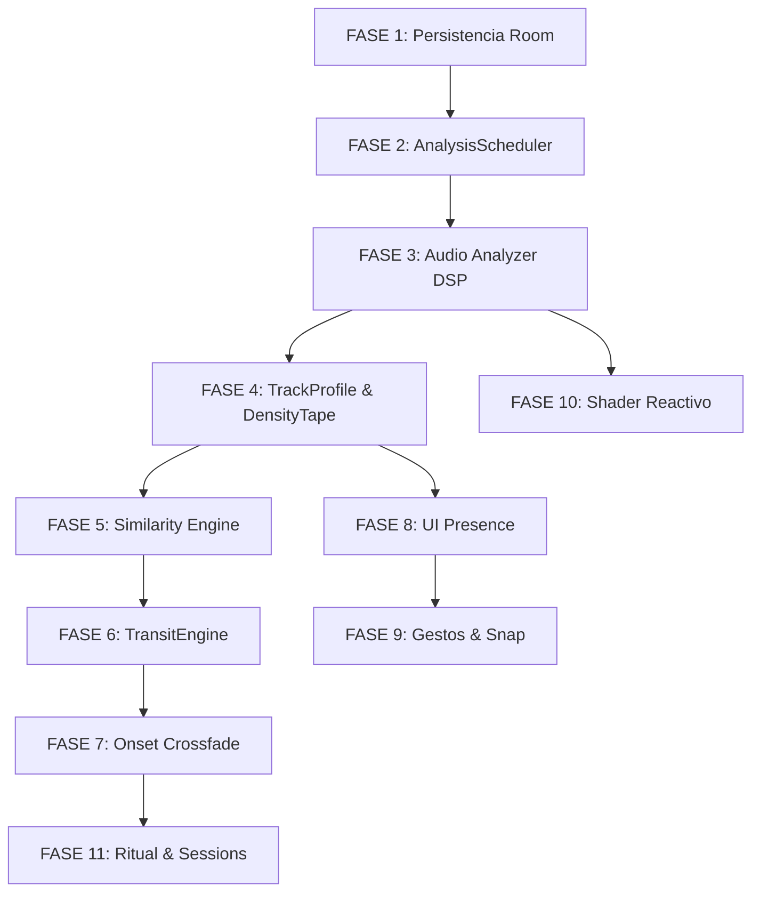

# AETHER — Roadmap de Implementación v0.1

Este documento define la estrategia técnica para evolucionar el proyecto AETHER desde su estado actual de "reproductor convencional" (v0.2) hasta el cumplimiento de la especificación conceptual definida en `AETHER_SPEC.md`.

---

## Estrategia General: Evolución, no Reconstrucción
Siguiendo las reglas de `AETHER_EVOLUTION_SPEC.md`, cada fase se integrará sobre el código existente, preservando la funcionalidad de reproducción y escaneo en todo momento.

---

## FASE 1 — Persistencia y Modelos de Datos Extendidos
**Objetivo:** Crear la infraestructura de almacenamiento necesaria para soportar el análisis musical y la sincronización eficiente con el dispositivo.

*   **Requisitos AETHER_SPEC:** REQ-3.1 (TrackRecord), REQ-3.2 (TrackProfile), REQ-3.3 (DensityTape).
*   **Estado Actual:** `Song.kt` es volátil; no hay base de datos (DB).
*   **Implementación Prevista:**
    *   Introducir **Room Persistence Library**.
    *   Crear `MusicDatabase`, `SongDao` y `ProfileDao`.
    *   Extend `Song` para incluir `invalidationKey` (fileSize, mtimeMs, durationMs).
*   **Archivos Afectados:**
    *   **MODIFICAR:** [Song.kt](file:///C:/Users/lator/AndroidStudioProjects/AETHER/app/src/main/java/com/example/aether/model/Song.kt), [MusicRepository.kt](file:///C:/Users/lator/AndroidStudioProjects/AETHER/app/src/main/java/com/example/aether/data/MusicRepository.kt).
    *   **CREAR:** `data/db/MusicDatabase.kt`, `data/db/SongEntity.kt`, `data/db/ProfileEntity.kt`.
*   **Preservar:** Escaneo de MediaStore y carga de UI actual.

---

## FASE 2 — AnalysisScheduler y Orquestación
**Objetivo:** Gestionar la cola de análisis de audio de forma asíncrona y eficiente sin interferir con la reproducción.

*   **Requisitos AETHER_SPEC:** REQ-4.1 (Análisis reactivo).
*   **Estado Actual:** No existe procesamiento fuera del main thread más allá del repositorio.
*   **Implementación Prevista:**
    *   Implementar `AnalysisScheduler` usando **WorkManager** para tareas en background y **Coroutines** (Dispatchers.Default) para análisis inmediato de la pista actual.
    *   Lógica de priorización: Pista actual (HEAD) > Pistas nuevas (FIFO).
*   **Archivos Afectados:**
    *   **CREAR:** `analysis/AnalysisScheduler.kt`, `analysis/AnalysisWorker.kt`.
    *   **MODIFICAR:** [MusicViewModel.kt](file:///C:/Users/lator/AndroidStudioProjects/AETHER/app/src/main/java/com/example/aether/ui/MusicViewModel.kt).

---

## FASE 3 — Audio Analyzer (Núcleo DSP)
**Objetivo:** Extraer las características físicas y rítmicas del audio.

*   **Requisitos AETHER_SPEC:** REQ-4.2 (FFT, RMS, Centroid, Flux, Onset, BPM).
*   **Estado Actual:** Cero procesamiento de audio.
*   **Implementación Prevista:**
    *   Decodificación PCM mono a 22_050 Hz (Media3 Decoder).
    *   Pipeline de procesamiento: Ventana Hann (2048) -> FFT -> Cálculo de descriptores.
    *   Detección de onsets mediante flujo espectral (Spectral Flux).
*   **Archivos Afectados:**
    *   **CREAR:** `analysis/AudioAnalyzer.kt`, `analysis/DspUtils.kt`.
*   **Riesgos:** Alto consumo de CPU. Requiere optimización en Kotlin/JVM o considerar JNI si es necesario.

---

## FASE 4 — TrackProfile e Integración de DensityTape
**Objetivo:** Generar y persistir el "ADN musical" de cada canción.

*   **Requisitos AETHER_SPEC:** REQ-3.2, REQ-3.3.
*   **Implementación Prevista:**
    *   Cálculo del `embedding` de 16 dimensiones.
    *   Cuantización de `energy`, `centroid` y `flux` a `uint8` para la cinta.
    *   Detección de fronteras de secciones.
*   **Archivos Afectados:**
    *   **MODIFICAR:** `data/db/ProfileEntity.kt`.
    *   **CREAR:** `model/TrackProfile.kt`, `model/DensityTape.kt`.

---

## FASE 5 — Similarity Engine y Selección Inteligente
**Objetivo:** Permitir que AETHER elija la siguiente canción basándose en el "vibe" y no solo en el orden alfabético.

*   **Requisitos AETHER_SPEC:** REQ-6.1, REQ-6.2.
*   **Implementación Prevista:**
    *   Cálculo de distancia euclidiana ponderada entre embeddings.
    *   Filtro de exclusión de historial (últimas 8 pistas).
    *   Fallback a reproducción por carpeta si no hay perfiles listos.
*   **Archivos Afectados:**
    *   **CREAR:** `analysis/SimilarityEngine.kt`.
    *   **MODIFICAR:** [MusicViewModel.kt](file:///C:/Users/lator/AndroidStudioProjects/AETHER/app/src/main/java/com/example/aether/ui/MusicViewModel.kt).

---

## FASE 6 — TransitEngine y Coordinación de Reproducción
**Objetivo:** Orquestar el momento exacto del cruce entre canciones.

*   **Requisitos AETHER_SPEC:** REQ-5.3 (Planificación de crossfade).
*   **Implementación Prevista:**
    *   Análisis de la ventana final de la pista A y la inicial de la B para encontrar onsets óptimos.
    *   Cálculo de la duración del fade (400ms - 1800ms).
*   **Archivos Afectados:**
    *   **CREAR:** `service/TransitEngine.kt`.
    *   **MODIFICAR:** [PlaybackService.kt](file:///C:/Users/lator/AndroidStudioProjects/AETHER/app/src/main/java/com/example/aether/service/PlaybackService.kt).

---

## FASE 7 — Crossfade "Onset-aware" (Doble Player)
**Objetivo:** Ejecutar la transición fluida sin cortes ni silencios.

*   **Requisitos AETHER_SPEC:** REQ-5.3.
*   **Implementación Prevista:**
    *   Evolucionar `PlaybackService` para gestionar **dos instancias de ExoPlayer**.
    *   Sincronización de volumen exponencial para el fade-out/fade-in coordinado.
*   **Archivos Afectados:**
    *   **MODIFICAR:** [PlaybackService.kt](file:///C:/Users/lator/AndroidStudioProjects/AETHER/app/src/main/java/com/example/aether/service/PlaybackService.kt), [MusicViewModel.kt](file:///C:/Users/lator/AndroidStudioProjects/AETHER/app/src/main/java/com/example/aether/ui/MusicViewModel.kt).
*   **Preservar:** Controles de medios del sistema y soporte de notificaciones.

---

## FASE 8 — Experiencia Presence (UI Inmersiva)
**Objetivo:** Transformar AETHER de una aplicación de listas a una experiencia visual.

*   **Requisitos AETHER_SPEC:** REQ-7.1, REQ-7.2.
*   **Implementación Prevista:**
    *   Crear `PresenceScreen` (Home full-bleed).
    *   Implementar `DensityTapeWidget` (SeekBar de energía interactivo).
    *   Chrome efímero (se oculta tras 2.2s).
*   **Archivos Afectados:**
    *   **CREAR:** `ui/presence/PresenceScreen.kt`, `ui/presence/DensityTapeWidget.kt`.
    *   **MODIFICAR:** [MusicScreens.kt](file:///C:/Users/lator/AndroidStudioProjects/AETHER/app/src/main/java/com/example/aether/ui/MusicScreens.kt), [MainActivity.kt](file:///C:/Users/lator/AndroidStudioProjects/AETHER/app/src/main/java/com/example/aether/MainActivity.kt).

---

## FASE 9 — Gestos Avanzados de Presence
**Objetivo:** Control total sin botones visibles.

*   **Requisitos AETHER_SPEC:** REQ-7.2 (Tabla de gestos).
*   **Implementación Prevista:**
    *   Seek con snap al onset más cercano (±180ms).
    *   Flick derecho (Next con crossfade) y Flick izquierdo (Prev).
    *   Long press para crear `Mark`.
*   **Archivos Afectados:**
    *   **CREAR:** `ui/presence/PresenceGestures.kt`.
    *   **MODIFICAR:** `ui/presence/PresenceScreen.kt`.

---

## FASE 10 — Shader de Presencia
**Objetivo:** Visualización reactiva al audio en tiempo real.

*   **Requisitos AETHER_SPEC:** REQ-7.4.
*   **Implementación Prevista:**
    *   Integrar **AGSL (Android Graphics Shading Language)**.
    *   Uniforms reactivos: `uEnergy`, `uCentroid`, `uFlux`, `uOnset`.
*   **Archivos Afectados:**
    *   **CREAR:** `ui/presence/PresenceShader.kt`.

---

## FASE 11 — Ritual, Sesiones y Mapa de Sesión
**Objetivo:** Cerrar el ciclo de experiencia del usuario.

*   **Requisitos AETHER_SPEC:** REQ-8, REQ-10.
*   **Estado:** COMPLETADO (ritual en Presence + `SessionMapScreen`; no se creó `RitualScreen` aparte).
*   **Implementación:**
    *   Modo Ritual (sin avance automático + residuo de fin).
    *   Persistencia de `SessionRecord`.
    *   Pinch gesture para abrir `SessionMap`.
*   **Archivos Afectados:**
    *   **CREAR:** `ui/session/SessionMapScreen.kt`, `data/db/SessionEntity.kt`.

---

## FASE 13 — Optimización, Errores y Hardening
**Objetivo:** Estabilidad de producto: fallos de archivo, batería, memoria y estados de error.

*   **Requisitos AETHER_SPEC:** §11 Estados y errores, §12 Performance.
*   **Equivalente Evolution Spec:** FASE 14 (el informe de avance numeró Session Map como Fase 12).
*   **Estado:** COMPLETADO.
*   **Implementación:**
    *   Skip + snack en archivos ilegibles/corruptos (`PlaybackService.onPlayerError`).
    *   Análisis single-flight con perfil `ERROR` persistido; WorkManager no reintenta corruptos.
    *   DSP streaming O(n), cuantización percentil 2–98, cooldown de onset.
    *   Shader AGSL pausado si no hay playback; fallback Canvas en API < 33.
    *   Pantalla de permiso, biblioteca vacía con escanear, idle de sesión 30 min.
*   **Archivos Afectados:**
    *   **MODIFICAR:** `PlaybackService.kt`, `AnalysisScheduler.kt`, `AudioAnalyzer.kt`, `AudioDecoder.kt`, `MusicViewModel.kt`, `MusicScreens.kt`, `MainActivity.kt`, `PresenceShader.kt`, `DensityTapeWidget.kt`.
    *   **CREAR:** `util/AetherLog.kt`, `analysis/AnalysisException.kt`.

---

## Dependencias Técnicas

---

## Definition of Done — AETHER

Un hito o fase se considera completado bajo las siguientes condiciones:

1.  **Compilación y Lint:** El proyecto compila sin errores y pasa las reglas de lint definidas.
2.  **Continuidad de Audio:** Ningún cambio en la UI o en el motor de análisis debe causar tartamudeos (stuttering) en la reproducción actual.
3.  **Fidelidad al Spec:** La funcionalidad implementada coincide con los parámetros matemáticos y de UX del `AETHER_SPEC.md`.
4.  **No Regresión:** Las funciones de escaneo, búsqueda y reproducción básica (v0.2) siguen funcionando.
5.  **Rendimiento:** El análisis de audio no consume más del 15% de CPU sostenido en segundo plano.
6.  **Validación Visual:** La `DensityTape` coincide visualmente con la dinámica percibida del audio.
7.  **Estado de Error:** Se manejan correctamente los archivos corruptos o sin permiso de lectura.
